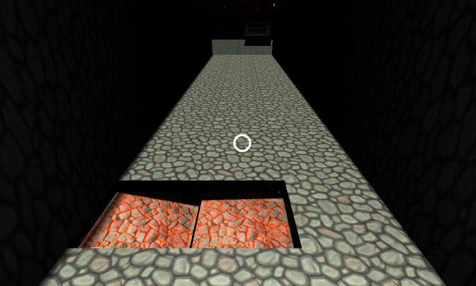

# Interfaces-Inteligentes

Este proyecto implementa un juego similar a los antiguos roguelikes, pero adapatados las nuevas tecnologías. Ha sido creado como proyecto de realidad virtual en Unity para la asignatura de Interfaces Inteligentes. 

## Funcionamiento

Para un correcto funcionamiento, será necesario instalar el juego en un dispositivo Android con una versión superior o igual a la 7.0. Además, debe disponer de un visor de RV compatible con [Daydream](https://vr.google.com/daydream/).

Para moverse por el juego, deberá hacerse uso del touchpad de un controlador DayDream, para ello, se puede usar un emulador para Android [Intrucciones aquí](https://developers.google.com/vr/daydream/controller-emulator). El cual también puede usarse para probarse en Unity. (Si no, usar ctrl+shift+ mover el ratón)

## Instrucciones de juego

### Fase 1
Al comienzo del juego se generará **aleatoriamente** un mapa con un **laberinto** y **dos salas** conectadas por medio de un **pasillo**. El jugador aparecerá en medio de uno de los pasillos del laberinto y, a partir de este momento, deberá recorrer los pasillos en penumbra, buscando el camino correcto que le llevará a la primera sala.

Si le resulta demasiado complicado encontrar la salida del laberinto, puede apuntar al suelo y pulsar el botón del visor. Esto generará una serie de partculas que le guiarán de camino a la primera sala.

Una vez encontrada la sala, tendrá que buscar la llave que se encuentra en el centro de la misma y que permitirá al jugador avanzar de fase.

### Fase 2

En este momento comienzan a surgir los enemigos poco a poco, 10 en total, alrededor de la sala. El jugador deberá dispararles con ayuda del gamepad y evitar que se acerquen demasiado, de lo contrario le matarán y habrá perdido la partida. Además, antes de que aparezca el enemigo, unas partículas haciendo efecto de humo avisan de la posición en la que saldrá.

### Fase 3 

Si lográ superar con éxito la anterior fase, tendrá que atravesar el pasillo que le lleva a la sala final. Sin embargo, en esta fase el movimiento del jugador no está permitido, solo podrá desplazarse hacia los lados moviendo la cabeza (haciendo uso de los sensores del acelerómetro del dispositivo). 

Se situará al jugador al comienzo del pasillo con una velocidad constante al tiempo que partes del suelo se van cayendo. El objetivo del jugador será tratar de sortear los huecos en suelo para no precipitarse al vacio.

### Fase 4

Una vez superadas todas las fases anteriores, el jugador podrá depositar en el baúl la llave que capturó en la fase 1, consiguiendo, de esta forma, alzarse con la codiciosa victoria. 

# Hitos 

* [x] Generación de un laberinto aleatorio cada partida. 
* [x] Desarrollo de un skybox personalizado.
* [x] Interacción del personaje con diferentes elementos de la escena (llave, enemigos, baúl).
* [x] Uso de numerosos sistemas de partículas al generar los enemigos, la solución del laberinto, al capturar la llave. 
* [x] Uso del patrón singleton para el controlador, así como de eventos de Unity.
* [x] Usar recomendaciones de VR. Añadir transiciones de fundido a negro, antes de mover a un personaje de un sitio a otro para evitar mareos
* [x] Incorporación de los datos obtenidos del acelerómetro para desplazar al jugador hacia los lados en la fase 3.
* [x] Uso de varias formas de interacción (Botón del cardboard, touchpad de DayDream).
* [x] Uso de animaciones para los enemigos, con una máquina de estados de las mismas para varias de animación en función de las circunstancias.
* [x] Uso de músicas en diferentes partes del juego para mejorar la experiencia.

# Acta de Trabajo en Equipo

Al ser reducido el número de miembros del grupo (2), una gran parte del trabajo se ha realizado en conjunto. Sin embargo, hay ciertas partes que se han hecho de forma individual, lo cual se detalla a continuación.

Es importante destacar que la colaboración ha sido muy estrecha, por lo que no se debería hablar de puestas en común del trabajo, puesto que siempre un miembro le comunicaba a otro lo que iba haciendo.

**Trabajo realizado en solitario por Pablo:**
* Fase 3
* Generación del pasillo de conexión entre habitaciones
* El sistema de animación de los enemigos
* Fase 2 (salvo evento de muerte)

**Trabajo realizado por Isaac:**
* Créditos finales
* Fundidos a negro
* Interacción con el Baúl en la última habitación
* Sistema de ayuda al usuario para encontrar la habitación (Partículas y algoritmo)
* Evento de muerte

**En conjunto:**
* Diseño del juego (Qué fases, jugabilidad, etc)
* Interacción con DayDream
* Generación del laberinto (MazeCell, MazeGen)
* Controlador (interfases)
* Skybox
* Músicas
* Aspectos visuales: Búsqueda de texturas, creación de Skybox, etc.

